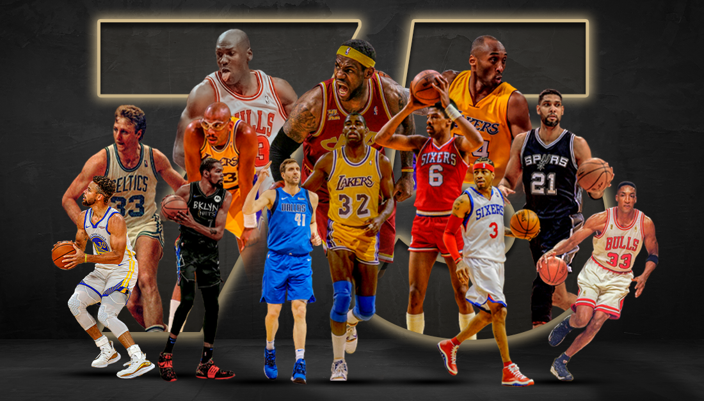

# 🏀 DAI-Assignment: NBA Players Analysis

## 📌 Student Details
- **Name:** *Ginjala Srivardhan*
- **Enrollment Number:** *23114028*
- **Batch:** *CS1*

## 📊 Overview
This project focuses on **data cleaning and exploratory data analysis (EDA)** for the NBA Players dataset. The dataset contains numerical and categorical attributes, requiring careful preprocessing before meaningful insights can be extracted.

## 📂 Dataset Chosen: **NBA Players Dataset**

🔗 **Source:** [Kaggle - NBA Players Data](https://www.kaggle.com/datasets/justinas/nba-players-data)

---

## 🛠 Tasks & Methodologies
### 1️⃣ Data Cleaning: Preprocessing for Reliable Analysis
- ✅ **Loading & Inspecting**: Checking data structure and attributes.
- ✅ **Handling Missing Values**: Using imputation/removal techniques.
- ✅ **Removing Duplicates**: Ensuring unique and accurate records.
- ✅ **Outlier Detection & Treatment**:
  - **Mild Outliers** (age, height, games played): Median imputation.
  - **Severe Outliers** (weight, points, assists, rebounds, etc.): Winsorization & log transformation.
- ✅ **Standardizing Categorical Values**: Fixing typos and inconsistencies.

### 2️⃣ Exploratory Data Analysis (EDA): Unveiling Insights
#### 🔍 *Univariate Analysis (Single-Variable Exploration)*
- 🔹 Summary Statistics: Mean, median, variance, skewness, etc.
- 🔹 Frequency Distributions for categorical attributes.
- 🔹 Visualizations: Histograms, box plots for distribution analysis.

#### 🔍 *Bivariate Analysis (Two-Variable Relationships)*
- 🔹 Correlation Matrix: Identifying relationships between numerical variables.
- 🔹 Scatter Plots: Exploring continuous variable dependencies.
- 🔹 Bar, Violin, and Box Plots: Comparing categorical & numerical attributes.

#### 🔍 *Multivariate Analysis (Multi-Feature Relationships)*
- 🔹 Pair Plots: Observing multiple variable interactions simultaneously.
- 🔹 Heatmaps: Visualizing correlations between different features.
- 🔹 Grouped Comparisons: Identifying combined effects of multiple factors.

---

## 🔥 Key Techniques Implemented
🚀 **Handling Outliers Efficiently:**
- **Mild Outliers:** IQR method + Median imputation (age, height, games played).
- **Extreme Outliers:** Log transformation + Winsorization (weight, points, rebounds, assists, etc.).

📈 **Visualization-Driven Analysis:**
- **Boxplots:** Before/After outlier handling comparison.
- **Histograms:** Distribution analysis.
- **Heatmaps:** Exploring feature correlations.

---

## 📌 Expected Outcomes
✔ Well-cleaned dataset ready for analysis.
✔ Statistical insights on player attributes.
✔ Clear visual representations of trends and relationships.
✔ Continuous comments on findings, aiding future predictive modeling.

🎯 *"Turning raw data into game-changing insights!"* 🏀📊

